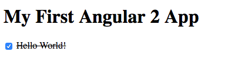

component
============================

## Install dependencies ##

```bash
npm install
```

## Run ##

```bash
npm start
```

<!-- If you are looking for details, check it here: [component](https://segmentfault.com/a/1190000004930079) -->



