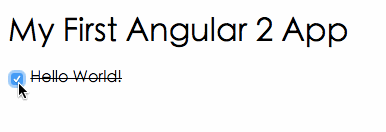

component
============================

## Install dependencies ##

```bash
npm install
```

## Run ##

```bash
npm start
```

If you are looking for details, check it here: [component](http://leftstick.github.io/tech/2016/04/14/angular2-02-component)



